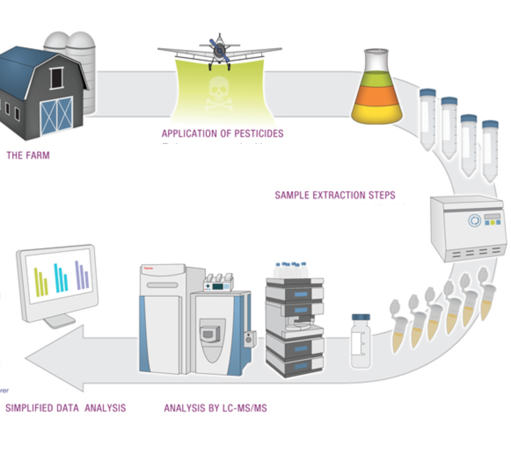
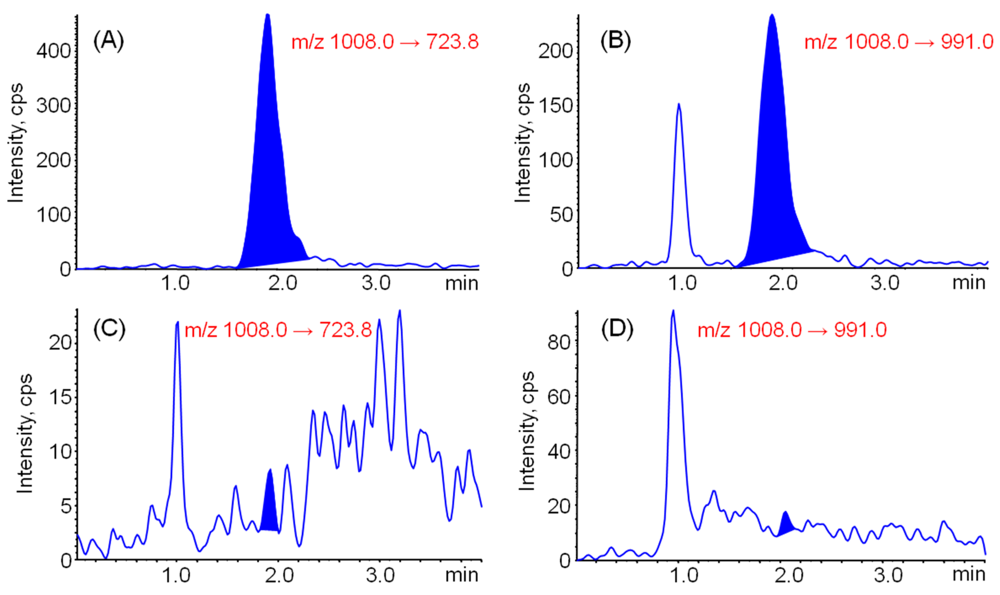

# Motivation
Analytical chemistry consists of extracting analytes of interest from samples and then analyzing on instruments and processing the data from this instrumental analysis. For some screening methods chemist evaluate thousands of chromatograms every day looking for possible positives. Depending on the method chemists can spend hours looking at chromatography. My goal is to use the data from the instruments to generate a model to predict positive results. If a model can predict positives with a low number of false negatives it could drastically reduce the amount of time chemists have to spend evaluating chromatograms. 

# Introduction to Analytical Chemistry
## Workflow
Figure 1: Process of pesticide analysi from application to instrumental analysis

Pesticide testing is one of many applications for analytical chemsitry and there are many different items that may need to be tested for pesticides. These include organic produce, hay fed to livestock, turf from children's sports fields, and many other applications. When a samples is sent into the lab the pesticides must be extracted away from any other material in the sample. The extraction process helps to reduce interferences and improve signal when the sample is injected on the instrument. After the extraction process the samples are loaded onto instruments that can separate and identify the pesticides. The data in this project was analyzed using liquid chromatography mass spectrometry. Each sample is applied to a solid phase column and liquid mobile phases are used to separate the pesticides. Every pesticide will have some attraction to the solid phase and some attraction to the liquid mobile phases. This difference of attraction will cause the pesticides to stay on the column for different lengths of time. While the pesticides are moving through the column there is some amount of spread that happens, so when the pesticide is eluted from the column and detected by the mass spec it appears as a gaussian peak. The software integrates this peak and stores the information that describes the peak in a table. The width, height, retention time and a number of other features are stored for each peak. 

Figure 2: Four chromatograms, the top two are examples of positives results and the bottom two are examples of integrated noise.

# Data

## Original Data

An analytical laboratory in the area provided me with the results from their pesticide analysis for the last two years. The laboratory analyzed the samples in batches, which included the samples, quality controls, and blanks. Each injection was analyzed for 17 pesticides, this resulted in over 56,000 data points for analysis. The following table show the different columns included with each point. The columns are separated into sections based on what part of the analysis is being described. The instrument and method sections are the same for every point. The internal standard section describe the peak of the internal standard, a compound added to each sample to evaluate extraction and instrument peformance. Only the columns describing the pesticide, aka analyte, or sample were kept as features for the initial exploratory data analysis.

Analyte/Sample | Instrument | Internal Standard | Method
---------------|------------|-------------------|--------
 'Sample Name', 'Sample ID', 'Sample Type', 'Sample Comment', 'Calculated Concentration (ng/mL)', 'Calculated Concentration for DAD (ng/mL)', 'Relative Retention Time', 'Accuracy (%)', 'Response Factor', 'In Flower Concentration ppm', , 'Analyte Peak Name', 'Analyte Units', 'Analyte Peak Area (counts)', 'Analyte Peak Area for DAD (mAU x min)', 'Analyte Peak Height (cps)', 'Analyte Peak Height for DAD (mAU)', 'Analyte Concentration (ng/mL)', 'Analyte Retention Time (min)', 'Analyte Expected RT (min)', 'Analyte RT Window (sec)', 'Analyte Centroid Location (min)', 'Analyte Start Scan', 'Analyte Start Time (min)', 'Analyte Stop Scan', 'Analyte Stop Time (min)', 'Analyte Integration Type', 'Analyte Signal To Noise', 'Analyte Peak Width (min)', 'Standard Query Status', 'Analyte Mass Ranges (Da)', 'Analyte Wavelength Ranges (nm)', 'Area Ratio', 'Height Ratio', 'Analyte Annotation', 'Analyte Channel', 'Analyte Peak Width at 50% Height (min)', 'Analyte Slope of Baseline (%/min)', 'Analyte Processing Alg.', 'Analyte Peak Asymmetry', 'Analyte Integration Quality'| 'Set Number', 'Acquisition Method', 'Acquisition Date', 'Rack Type', 'Rack Position', 'Vial Position', 'Plate Type', 'Plate Position', 'File Name'| 'IS Peak Name', 'IS Units', 'IS Peak Area (counts)', 'IS Peak Area for DAD (mAU x min)', 'IS Peak Height (cps)', 'IS Peak Height for DAD (mAU)', 'IS Concentration (ng/mL)', 'IS Retention Time (min)', 'IS Expected RT (min)', 'IS RT Window (sec)', 'IS Centroid Location (min)', 'IS Start Scan', 'IS Start Time (min)','IS Stop Scan', 'IS Stop Time (min)', 'IS Integration Type', 'IS Signal To Noise', 'IS Peak Width (min)', 'IS Mass Ranges (Da)', 'IS Wavelength Ranges (nm)', 'IS Channel', 'IS Peak Width at 50% Height (min)', 'IS Slope of Baseline (%/min)', 'IS Processing Alg.', 'IS Peak Asymmetry', 'IS Integration Quality' | 'Dilution Factor', 'Weight To Volume Ratio', 'Sample Annotation', 'Disposition', 'Use Record', 'Record Modified'

 Table1: Data columns table list the information provided with the data and groups the columns into the type of information the column describes. 

## Data Cleaning
### Labeling Samples
The data from the instrument was combine with the list of positives to provide a label for each data point. The analyte name and sample number for each data point was compared to a list of reported positives from the lab. Points that were reported positive were labeled with a 1 and samples that were not reported were labeled with a 0. 

### Screening Negatives
After inspecting the initial data it became clear that most of the non-reported samples did not have integrated peaks in the chromatogram window. This happens when the software does not find any peak above the noise threshold set in the method. The resulting row of data will contain zeros for every column that describes the integrated peak. Since this was typical of 98% of the non-reported results a model would be able to predict a negative result based on these zeros and still have very high accuracy. To avoid this problem, all the rows where a peak was not integrated were dropped. 

|     | Sample Name   | Sample Type   | Analyte Peak Name   |   Analyte Peak Area (counts) |   Analyte Peak Height (cps) |   Analyte Retention Time (min) |   Analyte Expected RT (min) |   Analyte Centroid Location (min) |   Analyte Start Scan |   Analyte Start Time (min) |   Analyte Stop Scan |   Analyte Stop Time (min) |   Analyte Peak Width (min) |   Area Ratio |   Height Ratio |   Analyte Peak Width at 50% Height (min) |   Analyte Slope of Baseline (%/min) |   Analyte Peak Asymmetry |   Analyte Integration Quality |   Relative Retention Time |
|----:|:--------------|:--------------|:--------------------|-----------------------------:|----------------------------:|-------------------------------:|----------------------------:|----------------------------------:|---------------------:|---------------------------:|--------------------:|--------------------------:|---------------------------:|-------------:|---------------:|-----------------------------------------:|------------------------------------:|-------------------------:|------------------------------:|--------------------------:|
| 211 | R20070101-09  | Unknown       | Malathion 1         |                            0 |                           0 |                           0    |                        4.54 |                              0    |                    0 |                       0    |                   0 |                      0    |                      0     |          0   |          0     |                                   0      |                                0    |                     0    |                         0     |                         0 |
| 212 | R20070101-09  | Unknown       | Myclobutanil 1      |                         8633 |                        2433 |                           4.62 |                        4.64 |                              4.63 |                   38 |                       4.56 |                  52 |                      4.72 |                      0.157 |          0.2 |          0.209 |                                   0.0573 |                                3.94 |                     1.49 |                         0.914 |                         1 |

Table 2: Two rows of data, the top is an example of a chromatogram with no integrated peak and the bottom is an example of a chromatogram with an integrated peak.

After the datapoints without an integrated chromatogram were removed there were 1,843 points remaining, with 236 of these having been reported.

## EDA
The exploratory data anlysis started with assessing the features using an understanding of chemistry. There are a number of features that describe the width of the peak. The features describing the start and stop of the peak were dropped, and the peak width feature was kept. Also a retention time difference feature was calculated by subtracting the expected retention time from the observed retention time. 

After dropping features that were used to calculate other features there were still a number of featues that could be directly related to one another. Here is are scatter plots for four of these pairs of features.

