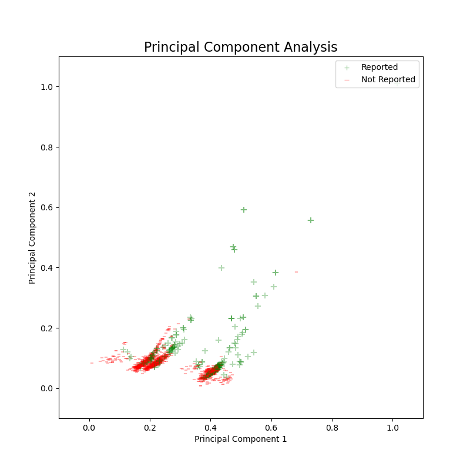
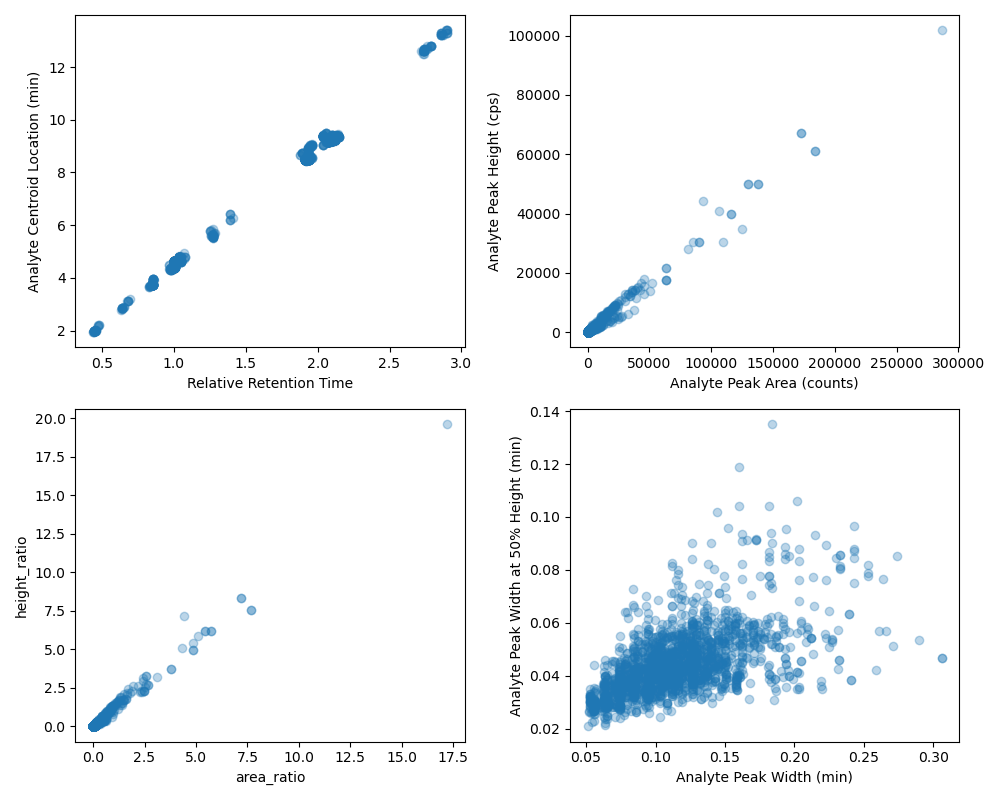
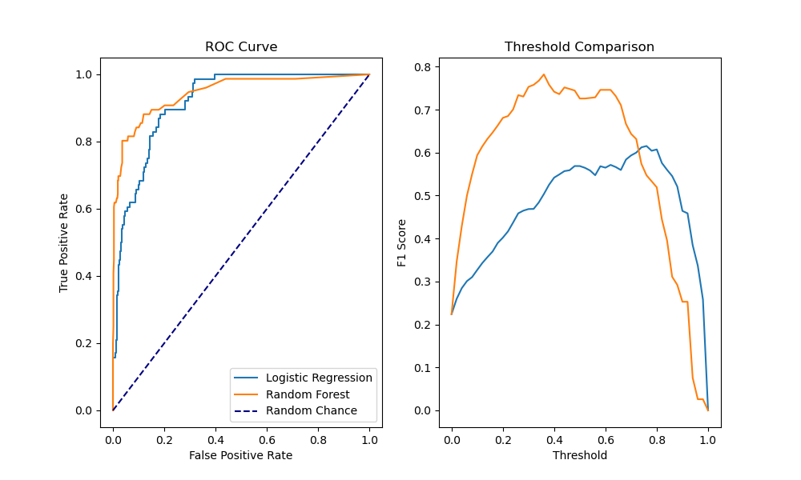
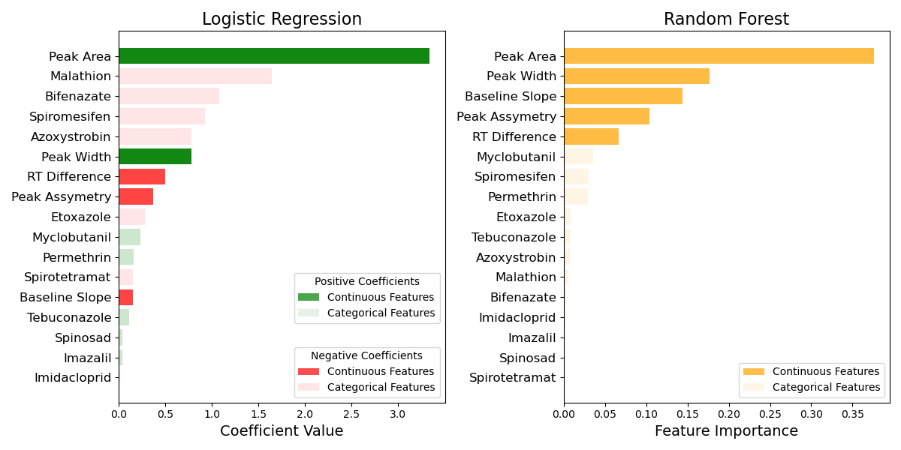

# Motivation
Analytical chemistry consists of extracting analytes of interest from samples and then analyzing on instruments and processing the data from this instrumental analysis. For some screening methods chemists evaluate thousands of chromatograms every day looking for possible positives. Depending on the method chemists can spend hours looking at chromatography. My goal is to use the data from the instruments to generate a model to predict positive results from chromatograms. If a model can predict positives with a low number of false negatives it could drastically reduce the amount of time chemists have to spend evaluating chromatograms. 

# Introduction to Analytical Chemistry
## Workflow

Figure 1: Process of pesticide analysis from application to instrumental analysis
https://planetorbitrap.com/targeted-screening-and-quantitation-of-food-contaminants

Pesticide testing is one of many applications for analytical chemistry and there are many different items that may need to be tested for pesticides. These include organic produce, hay fed to livestock, turf from children's sports fields, and many other applications. When a sample is sent into the lab the pesticides must be extracted away from any other material in the sample. The extraction process helps to reduce interferences and improve signal when the sample is injected on the instrument. After the extraction process the samples are loaded onto instruments that can separate and identify the pesticides. 

GIF 1: Animation of chromatography
https://en.wikipedia.org/wiki/File:Analytical_Gas_Chromatography_A.gif

The data in this project was analyzed using liquid chromatography mass spectrometry. Each sample is applied to a solid phase column and liquid mobile phases are used to separate the pesticides. Every pesticide will have some attraction to the solid phase and some attraction to the liquid mobile phases. This difference of attraction will cause the pesticides to stay on the column for different lengths of time. While the pesticides are moving through the column there is some amount of spread that happens, so when the pesticide is eluted from the column and detected by the mass spec it appears as a gaussian peak. The software integrates this peak and stores the information that describes the peak in a table. The width, height, retention time and a number of other features are stored for each peak. 

Figure 2: Four chromatograms, the top two are examples of positives results and the bottom two are examples of integrated noise.

# Data

## Original Data

An analytical laboratory in the area provided me with the results from their pesticide analysis for the last two years. The laboratory analyzed the samples in batches, which included the samples, quality controls, and blanks. Each injection was analyzed for 17 pesticides, this resulted in over 56,000 data points for analysis. The following table shows the different features included with each point. The features are separated into columns based on what part of the analysis is being described. The instrument and method sections are the same for every point. The internal standard section describes the peak of the internal standard, a compound added to each sample to evaluate extraction and instrument performance. Only the columns describing the pesticide, aka analyte, or sample were kept as features for the initial exploratory data analysis.

Analyte/Sample | Instrument | Internal Standard | Method
---------------|------------|-------------------|--------
 'Sample Name', 'Sample ID', 'Sample Type', 'Sample Comment', 'Calculated Concentration (ng/mL)', 'Calculated Concentration for DAD (ng/mL)', 'Relative Retention Time', 'Accuracy (%)', 'Response Factor', 'In Flower Concentration ppm', , 'Analyte Peak Name', 'Analyte Units', 'Analyte Peak Area (counts)', 'Analyte Peak Area for DAD (mAU x min)', 'Analyte Peak Height (cps)', 'Analyte Peak Height for DAD (mAU)', 'Analyte Concentration (ng/mL)', 'Analyte Retention Time (min)', 'Analyte Expected RT (min)', 'Analyte RT Window (sec)', 'Analyte Centroid Location (min)', 'Analyte Start Scan', 'Analyte Start Time (min)', 'Analyte Stop Scan', 'Analyte Stop Time (min)', 'Analyte Integration Type', 'Analyte Signal To Noise', 'Analyte Peak Width (min)', 'Standard Query Status', 'Analyte Mass Ranges (Da)', 'Analyte Wavelength Ranges (nm)', 'Area Ratio', 'Height Ratio', 'Analyte Annotation', 'Analyte Channel', 'Analyte Peak Width at 50% Height (min)', 'Analyte Slope of Baseline (%/min)', 'Analyte Processing Alg.', 'Analyte Peak Asymmetry', 'Analyte Integration Quality'| 'Set Number', 'Acquisition Method', 'Acquisition Date', 'Rack Type', 'Rack Position', 'Vial Position', 'Plate Type', 'Plate Position', 'File Name'| 'IS Peak Name', 'IS Units', 'IS Peak Area (counts)', 'IS Peak Area for DAD (mAU x min)', 'IS Peak Height (cps)', 'IS Peak Height for DAD (mAU)', 'IS Concentration (ng/mL)', 'IS Retention Time (min)', 'IS Expected RT (min)', 'IS RT Window (sec)', 'IS Centroid Location (min)', 'IS Start Scan', 'IS Start Time (min)','IS Stop Scan', 'IS Stop Time (min)', 'IS Integration Type', 'IS Signal To Noise', 'IS Peak Width (min)', 'IS Mass Ranges (Da)', 'IS Wavelength Ranges (nm)', 'IS Channel', 'IS Peak Width at 50% Height (min)', 'IS Slope of Baseline (%/min)', 'IS Processing Alg.', 'IS Peak Asymmetry', 'IS Integration Quality' | 'Dilution Factor', 'Weight To Volume Ratio', 'Sample Annotation', 'Disposition', 'Use Record', 'Record Modified'

 Table1: Data columns table list the information provided with the data and groups the columns into the type of information the column describes. 

## Data Cleaning
### Labeling Samples
The data from the instrument was combined with the list of reported results to provide a label for each data point. The analyte name and sample number for each data point was compared to a list of reported results from the lab. Points that were reported were labeled with a 1 and samples that were not reported were labeled with a 0. 

### Screening Negatives
After inspecting the initial data it became clear that most of the non-reported samples did not have integrated peaks in the chromatogram window. This happens when the software does not find any peak above the noise threshold set in the method. The resulting row of data will contain zeros for every feature that describes the integrated peak. Since this was typical of 98% of the non-reported results a model would be able to predict a negative result based on these zeros and still have very high accuracy. To avoid this problem, all the rows where a peak was not integrated were dropped. 

|     | Sample Name   | Sample Type   | Analyte Peak Name   |   Analyte Peak Area (counts) |   Analyte Peak Height (cps) |   Analyte Retention Time (min) |   Analyte Expected RT (min) |   Analyte Centroid Location (min) |   Analyte Start Scan |   Analyte Start Time (min) |   Analyte Stop Scan |   Analyte Stop Time (min) |   Analyte Peak Width (min) |   Area Ratio |   Height Ratio |   Analyte Peak Width at 50% Height (min) |   Analyte Slope of Baseline (%/min) |   Analyte Peak Asymmetry |   Analyte Integration Quality |   Relative Retention Time |
|----:|:--------------|:--------------|:--------------------|-----------------------------:|----------------------------:|-------------------------------:|----------------------------:|----------------------------------:|---------------------:|---------------------------:|--------------------:|--------------------------:|---------------------------:|-------------:|---------------:|-----------------------------------------:|------------------------------------:|-------------------------:|------------------------------:|--------------------------:|
| 211 | R20070101-09  | Unknown       | Malathion 1         |                            0 |                           0 |                           0    |                        4.54 |                              0    |                    0 |                       0    |                   0 |                      0    |                      0     |          0   |          0     |                                   0      |                                0    |                     0    |                         0     |                         0 |
| 212 | R20070101-09  | Unknown       | Myclobutanil 1      |                         8633 |                        2433 |                           4.62 |                        4.64 |                              4.63 |                   38 |                       4.56 |                  52 |                      4.72 |                      0.157 |          0.2 |          0.209 |                                   0.0573 |                                3.94 |                     1.49 |                         0.914 |                         1 |

Table 2: Two rows of data, the top is an example of a chromatogram with no integrated peak and the bottom is an example of a chromatogram with an integrated peak.

After the data points without an integrated chromatogram were removed there were 1,824 points remaining, with 239 of these having been reported.

## EDA
### Principal Component Analysis
The initial portion of the exploratory data analysis was to evaluate if the data contained enough signal to distinguish the reported samples from the non-reported samples. So, I one hot encoded the analyte names and ran a PCA on the data. When plotted, this showed that there were distinct areas where reported results were located. The reported locations appear to correspond to the upper tips of a few different sections and almost all points in the top right corner. 

Figure 3: Biplot of the first two principal components

### Feature Engineering
There are a number of features that describe the width of the peak. The features describing the start and stop of the peak were dropped, and the peak width feature was kept. Also a retention time difference feature was calculated by subtracting the expected retention time from the observed retention time. 

After dropping features that were used to calculate other features there were still a number that could be collinear. Figure 4 shows four of these pairs of features. Three of the four pairs are highly collinear and one of the pairs is correlated. One of each of these pairs of features needed to be dropped. 

### <Scatter Plot Comparisons>

Figure 4: Scatter plots of pairs of features that were expected to be collinear

### Feature Selection
Instead of arbitrarily picking one of the features, a lasso regression was run with varying learning rates and the weights of the coefficients were plotted. Using this plot I selected the feature in each collinear pair that had a lower weight on the model, or was set to a weight zero at a lower learning rate. 

Figure 5: Lasso Regularization

Based on the lasso regularization plot Analyte Centroid Location, Analyte Peak Height, height_ratio, and Analyte Peak Width were removed. The variance inflation factors were calculated for each remaining feature which showed there were still collinear features in the data. These features were again compared to the lasso plot to pick the least important collinear features to drop. This process was iterated until the remaining features showed low collinearity. The final features and are included in Table 3 below.

| VIF Factor | Features                               |
|-----------:|:---------------------------------------|
|     11.4   | Analyte Peak Width (min)               |
|     6.24   | Analyte Peak Asymmetry                 |
|     2.00   | Retention Time Difference              |
|     1.29   | Analyte Peak Area (counts)             |
|     1.07   | Baseline                               |

Table 3: Variance Inflation Factor for features

# Models
## Model Comparison
In order to understand the importance of the features for each of the models, Logistic Regression and Random Forest were chosen. A randomized search was performed to determine the best hyperparameters for fitting each model. The hyperparameters were very similar whether the five non-collinear features or all the features were used for training the data. A ROC plot and plot of F1 score vs threshold were used to compare the performance of the logistic regression to the random forest. The best F1 score for the logistic regression and random forest 0.61 and 0.76 respectively.

Figure 6: ROC curve and F1 score comparison over various thresholds for logistic regression and random forest classifier

## Model Interpretation
 The coefficients and the feature importances of the models were compared to see if the models were assigning similar weight to the features. The area of the peak was the most important feature for both models, but the logistic regression put much more weight on the different analytes than the random forest did. The random forest put almost no weight on any of the analyte features. This could be due to the nature of random forest feature importance calculation having an impact from the number of times a feature is used for a split. Since all of the analyte features are one hot encoded categorical features the random forest can split on these features a maximum of one time making them less important than the other continuous features. 

# Conclusion
Both the logistic regression and random forest models are finding signal to classify the chromatograms. The peak area is the most important feature for both models. Many of the chromatograms with integrated peaks are finding the analyte of interest, but the concentration in the unreported samples is below the reporting limit. Since the area is directly related to the concentration it is not surprising that these models are putting a large weight on that feature. 

## Future Work
- Determine F-statistic and p-values for logistic regressions
- Identify incorrectly classified chromatograms to determine what is causing problems for the models
- Repeat logistic and random forest modeling with all features to see if predictions improve
- Try other classification algorithms including Neural Nets
- Use sampling techniques such as undersampling, oversampling and SMOTE to account for the imbalance in the data